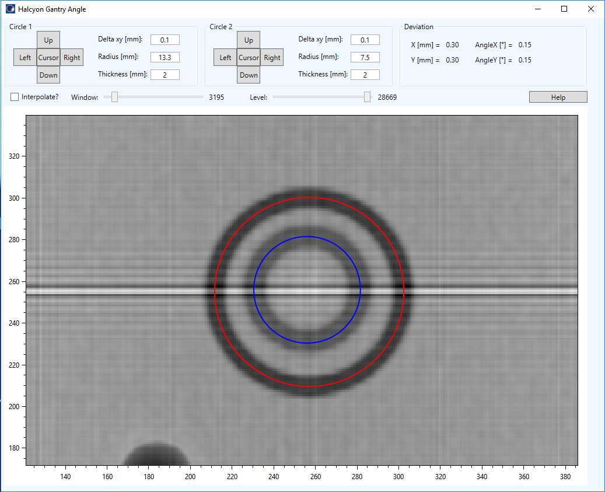
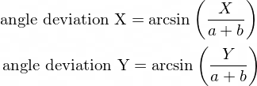

# Halcyon gantry angle
Varian ESAPI script for displaying a 2D image of the Cirs IsoCube with two circular objects that are used to calculate the Halcyon gantry angle deviation.



## Setup

To use the script, you must compile it on your system. You should be able to open the project with Visual Studio 2019 Community Edition. Open the .sln file in Dosimetry folder. 
The script was developed for Eclipse version 15.6. It may not work with other versions of Eclipse or Varian ESAPI.

1. You will need to restore NuGet package for compilation: OxyPlot. Right click the solution -> Restore NuGet packages.
2. Don't forget the references to Varian dlls.
3. Compile as Release for x64.

## Use

1. In External Beam Planning open a 2D portal image of the phantom. You can set Window/Level before running the script.
2. Run the script.
3. Read the Help to learn how to move the circles.

Angle deviations are calculated with this formula:



Here *a* is the distance of the upper circle from the center of the cube, and *b* is the distance of the lower circle from the center of the cube (a = b = 5.7 cm).

## Important note

**Before using this program see the [licence](https://github.com/brjdenis/VarianESAPI-HalcyonGantryAngle/blob/master/LICENSE) and make sure you understand it. The program comes with absolutely no guarantees of any kind.**

```
THE SOFTWARE IS PROVIDED "AS IS", WITHOUT WARRANTY OF ANY KIND, EXPRESS OR
IMPLIED, INCLUDING BUT NOT LIMITED TO THE WARRANTIES OF MERCHANTABILITY,
FITNESS FOR A PARTICULAR PURPOSE AND NONINFRINGEMENT. IN NO EVENT SHALL THE
AUTHORS OR COPYRIGHT HOLDERS BE LIABLE FOR ANY CLAIM, DAMAGES OR OTHER
LIABILITY, WHETHER IN AN ACTION OF CONTRACT, TORT OR OTHERWISE, ARISING FROM,
OUT OF OR IN CONNECTION WITH THE SOFTWARE OR THE USE OR OTHER DEALINGS IN THE
SOFTWARE.
```


## LICENSE

Published under the MIT license. 